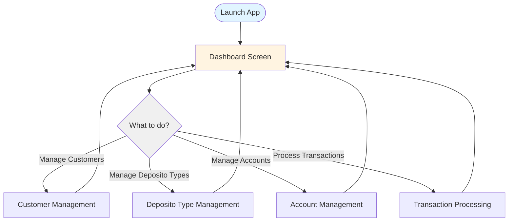
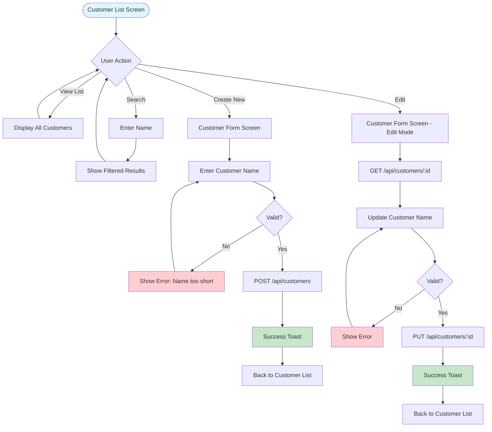
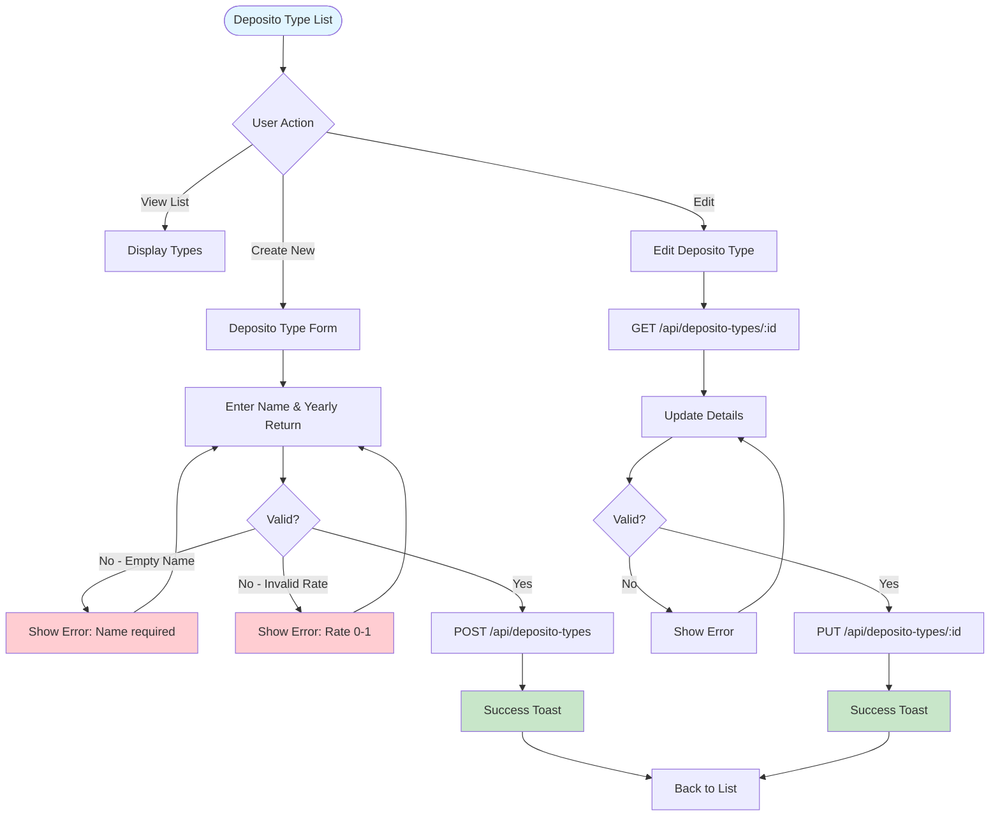
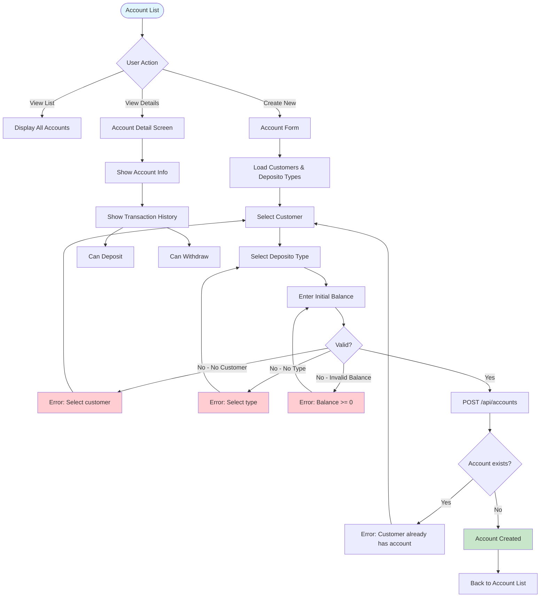
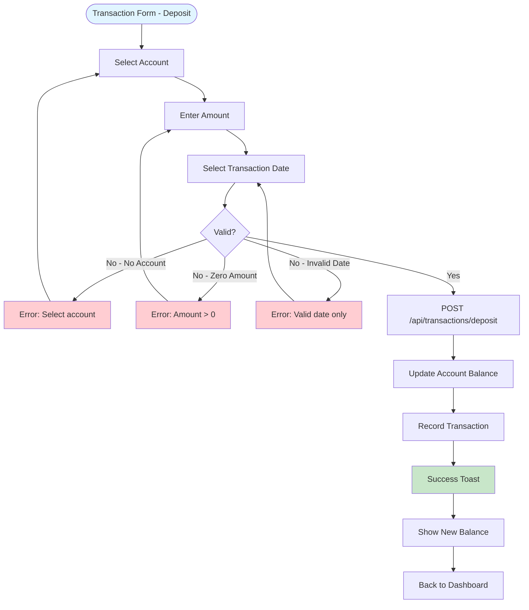
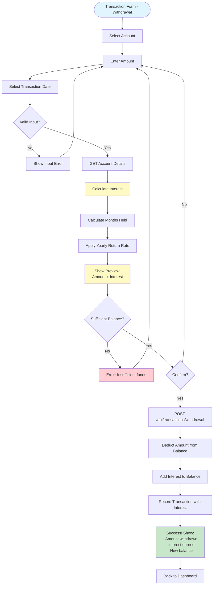
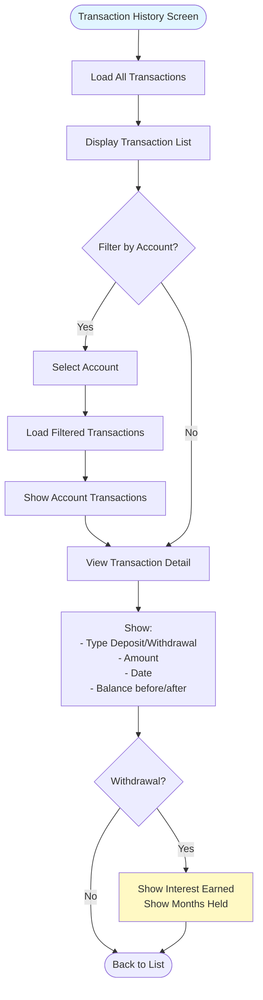
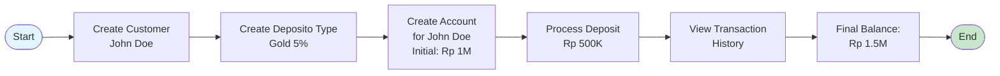

# User Journey Diagram - Bank Saving System

## 🎯 User Persona

**Bank Staff / Teller**
- Role: Manage customer data and process banking transactions
- Goal: Efficiently handle customer deposits and withdrawals
- Need: Simple, fast mobile app for on-the-go banking operations

---

## 🗺️ Main User Journey Flow

---

## 👤 Journey 1: Customer Management

### Flow Diagram

### Steps Description
1. **View Customers** - User sees list of all customers
2. **Search** - User can search by name
3. **Create** - User enters name (min 3 characters) → Save → Success toast
4. **Edit** - User selects customer → Update name → Save → Success toast
5. **Delete** - User long-press → Confirm → Delete

---

## 💰 Journey 2: Deposito Type Management

### Flow Diagram

### Steps Description
1. **View Types** - See all deposito types with yearly return rates
2. **Create** - Enter name + yearly return (0-1, e.g., 0.05 for 5%)
3. **Edit** - Update existing type
4. **Delete** - Remove unused types

---

## 🏦 Journey 3: Account Creation & Management

### Flow Diagram

### Steps Description
1. **View Accounts** - See all accounts with balance
2. **Create Account**:
   - Select customer
   - Select deposito type
   - Enter initial balance (optional)
   - Submit → Account created
3. **View Detail** - See account info + transaction history
4. **Quick Actions** - Deposit or Withdraw from detail screen

---

## 💸 Journey 4: Transaction Processing

### Deposit Flow

### Withdrawal Flow

### Steps Description

#### Deposit Journey
1. Select account
2. Enter deposit amount
3. Select transaction date
4. Submit → Balance updated → Success message

#### Withdrawal Journey
1. Select account
2. Enter withdrawal amount
3. Select transaction date
4. **System calculates interest**:
   - Get account creation date
   - Calculate months held
   - Apply yearly return: `interest = balance × yearly_return × (months / 12)`
5. Show preview (amount + interest)
6. Confirm withdrawal
7. Submit → Balance updated (deducted + interest) → Success message

---

## 📊 Journey 5: View Transaction History

### Flow Diagram

### Steps Description
1. View all transactions (all accounts)
2. Filter by specific account (optional)
3. See transaction details:
   - Type (deposit/withdrawal)
   - Amount
   - Date
   - Balance before/after
   - **For withdrawals:** Interest earned + months held

---

## 🔄 Complete User Journey Example

### Scenario: New Customer Opening Account & Depositing Funds

**Steps:**
1. **Create Customer** → "John Doe" created
2. **Create Deposito Type** → "Gold Deposito" with 5% yearly return
3. **Create Account** → Link John + Gold type, Rp 1,000,000 initial
4. **Deposit** → Add Rp 500,000
5. **View History** → See deposit transaction
6. **Result** → Account balance: Rp 1,500,000

---

## ⏱️ Journey Metrics

| Journey | Average Steps | Time Estimate |
|---------|--------------|---------------|
| Create Customer | 3 steps | 30 seconds |
| Create Deposito Type | 3 steps | 45 seconds |
| Create Account | 4 steps | 60 seconds |
| Process Deposit | 4 steps | 45 seconds |
| Process Withdrawal | 5 steps | 60 seconds |
| View Transaction | 2 steps | 15 seconds |

---

## 🎯 Key User Goals

1. ✅ **Quick Customer Onboarding** - Minimal steps to create customer
2. ✅ **Flexible Deposito Types** - Easy to configure interest rates
3. ✅ **Simple Account Creation** - Clear dropdown selections
4. ✅ **Fast Transactions** - Streamlined deposit/withdrawal
5. ✅ **Automatic Interest** - System calculates interest on withdrawal
6. ✅ **Transaction Visibility** - Easy to view history

---

## 📱 UX Highlights

- **Pull-to-Refresh** - On all list screens
- **Search** - Quick customer lookup
- **Validation** - Real-time input validation
- **Toast Messages** - Success/error feedback
- **Loading States** - Clear loading indicators
- **Error Messages** - User-friendly error descriptions
- **Interest Preview** - Show interest before withdrawal
