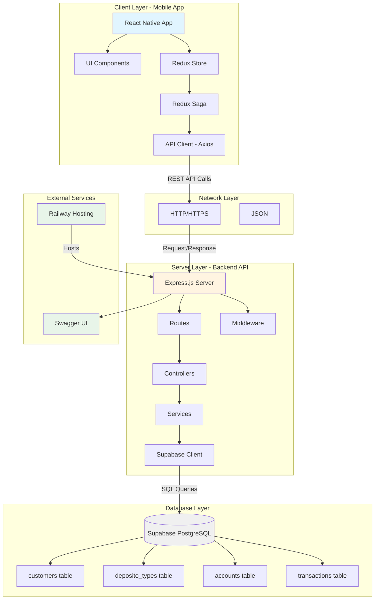
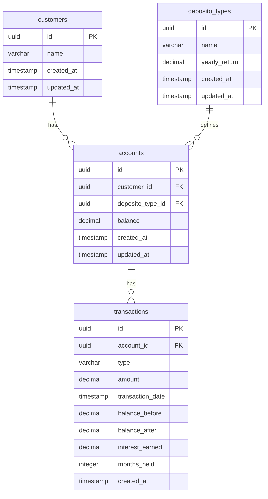

# System Architecture Diagram - Bank Saving System

## 🏗️ High-Level Architecture

Bank Saving System menggunakan arsitektur **Client-Server** dengan **RESTful API** sebagai penghubung antara mobile app dan database.

---

## 📊 System Architecture Diagram



---

## 🔧 Technology Stack

### Frontend (Mobile)
- **Framework:** React Native
- **State Management:** Redux + Redux Saga
- **HTTP Client:** Axios
- **UI Components:** Custom components
- **Navigation:** React Navigation
- **Development Tools:** Reactotron

### Backend (API)
- **Runtime:** Node.js
- **Framework:** Express.js
- **Language:** TypeScript
- **Validation:** express-validator
- **Documentation:** Swagger (swagger-jsdoc + swagger-ui-express)
- **CORS:** cors middleware
- **Logging:** morgan

### Database
- **Platform:** Supabase
- **Database:** PostgreSQL
- **Client:** @supabase/supabase-js

### Hosting & Deployment
- **Backend Hosting:** Railway
- **Production URL:** https://banksavingsystem-api-production.up.railway.app

---

## 📱 Client Layer Details

### React Native App Structure
```
src/
├── components/         # Reusable UI components
│   └── common/        # Input, Button, etc.
├── screens/           # Screen components
│   ├── Customer/
│   ├── DepositoType/
│   ├── Account/
│   └── Transaction/
├── store/             # Redux store
│   ├── slices/        # Redux slices
│   └── sagas/         # Redux sagas
├── services/          # API services
│   ├── api.ts         # Axios config
│   ├── customerService.ts
│   ├── depositoTypeService.ts
│   ├── accountService.ts
│   └── transactionService.ts
└── navigation/        # Navigation config
```

### State Management Flow
```
UI Component → Dispatch Action → Redux Saga → API Call → Response → Update Store → Re-render UI
```

---

## 🖥️ Server Layer Details

### Express.js API Structure
```
src/
├── config/            # Configuration
│   ├── supabase.ts   # Supabase client
│   └── swagger.ts    # Swagger config
├── types/             # TypeScript types
├── middleware/        # Express middleware
│   ├── errorHandler.ts
│   └── validator.ts
├── controllers/       # Request handlers
├── services/          # Business logic
├── routes/            # Route definitions
└── server.ts          # Express app
```

### Request Flow
```
HTTP Request → Routes → Validation Middleware → Controller → Service → Supabase Client → Database
                                                                                              ↓
HTTP Response ← JSON Formatter ← Controller ← Service Result ← Query Result ←────────────────┘
```

---

## 💾 Database Layer Details

### Supabase PostgreSQL Schema



---

## 🔄 Data Flow

### Create Customer Flow
```
Mobile App → POST /api/customers → ValidationMiddleware → CustomerController 
→ CustomerService.create() → Supabase INSERT → Return Customer Object 
→ Response to App → Update Redux Store → Re-render UI
```

### Process Withdrawal with Interest Flow
```
Mobile App → POST /api/transactions/withdrawal → ValidationMiddleware 
→ TransactionController → TransactionService.processWithdrawal()
  ├─ Get Account Details (with deposito_type)
  ├─ Calculate Interest (yearly_return × months_held / 12)
  ├─ Validate Sufficient Balance
  ├─ Update Account Balance
  └─ Record Transaction (with interest details)
→ Response to App → Update Redux Store → Re-render UI
```

---

## 🌐 Communication Protocols

### API Communication
- **Protocol:** HTTP/HTTPS
- **Format:** JSON
- **Methods:** GET, POST, PUT, DELETE
- **Authentication:** Not implemented (per requirements)
- **Base URL (Dev):** `http://10.0.2.2:3000/api`
- **Base URL (Prod):** `https://banksavingsystem-api-production.up.railway.app/api`

### Request/Response Format
```json
// Success Response
{
  "success": true,
  "data": { ... }
}

// Error Response
{
  "success": false,
  "error": "Error message"
}
```

---

## 🔒 Security Layers

### Input Validation
- express-validator on all endpoints
- Type checking (TypeScript)
- Required field validation
- Data format validation

### Error Handling
- Global error handler middleware
- Custom AppError class
- Proper HTTP status codes
- User-friendly error messages

### Database Security
- Supabase Row Level Security (RLS) - Optional
- Parameterized queries (SQL injection prevention)
- UUID primary keys (prevent enumeration)

---

## 📊 Scalability Considerations

### Current Architecture
- Stateless API (horizontal scaling ready)
- Database via Supabase (managed scaling)
- Mobile client (distributed load)

### Future Enhancements
- Load balancer (if needed)
- Caching layer (Redis)
- CDN for static assets
- Database read replicas
- Authentication & authorization (JWT)

---

## 🛠️ Development vs Production

### Development Environment
- Backend: `localhost:3000`
- Database: Supabase (shared instance)
- Debugging: Reactotron enabled
- Hot reload: Enabled

### Production Environment
- Backend: Railway hosting
- Database: Supabase (production instance)
- Debugging: Disabled
- Optimized builds
- HTTPS enforced

---

## ✅ Architecture Benefits

1. **Separation of Concerns** - Clear layer separation
2. **Scalability** - Stateless API, managed database
3. **Maintainability** - Modular structure
4. **Type Safety** - TypeScript throughout
5. **Documentation** - Swagger for API docs
6. **Error Handling** - Centralized error management
7. **Validation** - Input validation at all levels
8. **Testing Ready** - Testable service layer

---

## 🎯 System Characteristics

- **Architecture Style:** Client-Server, RESTful
- **Communication:** Synchronous HTTP
- **State Management:** Redux (Frontend)
- **Business Logic:** Service Layer (Backend)
- **Data Persistence:** PostgreSQL (Supabase)
- **Deployment:** Cloud-hosted (Railway + Supabase)
