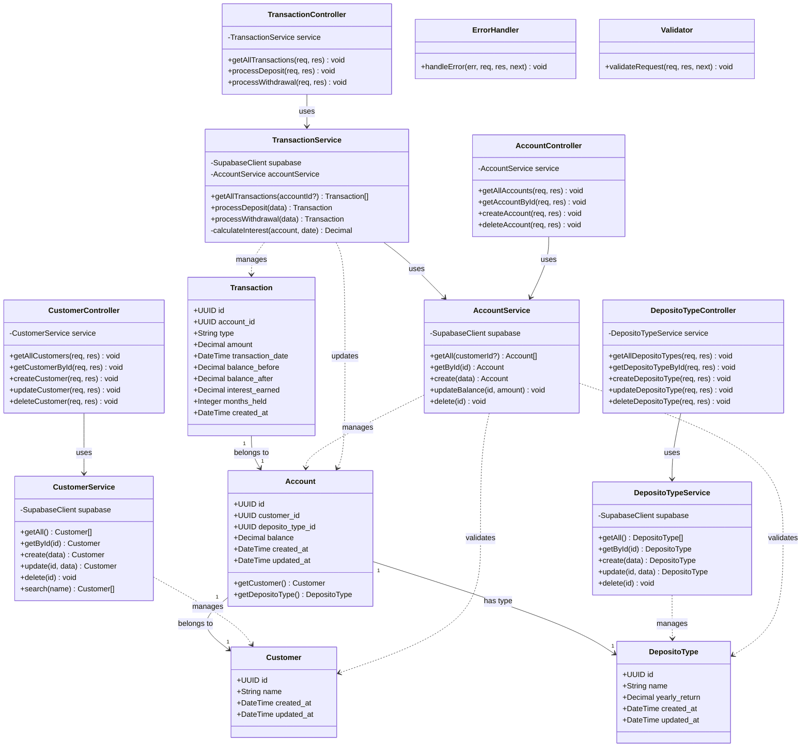

# Class Diagram - Bank Saving System

## 🎯 System Architecture

Bank Saving System menggunakan arsitektur MVC (Model-View-Controller) dengan layer separation:
- **Entity Layer** - Data models
- **Service Layer** - Business logic
- **Controller Layer** - HTTP request handlers
- **Frontend** - React Native UI components

---

## 📊 Class Diagram



---

## 🏗️ Layer Descriptions

### 1. Entity Layer (Data Models)

#### Customer
**Attributes:**
- `id` (UUID) - Unique identifier
- `name` (String) - Customer full name
- `created_at` (DateTime) - Creation timestamp
- `updated_at` (DateTime) - Last update timestamp

**Relationships:**
- Has many `Account`

---

#### DepositoType
**Attributes:**
- `id` (UUID) - Unique identifier
- `name` (String) - Deposito type name (e.g., "Gold Deposito")
- `yearly_return` (Decimal) - Annual interest rate (0-1, e.g., 0.05 = 5%)
- `created_at` (DateTime) - Creation timestamp
- `updated_at` (DateTime) - Last update timestamp

**Relationships:**
- Has many `Account`

---

#### Account
**Attributes:**
- `id` (UUID) - Unique identifier
- `customer_id` (UUID) - Foreign key to Customer
- `deposito_type_id` (UUID) - Foreign key to DepositoType
- `balance` (Decimal) - Current account balance
- `created_at` (DateTime) - Account creation date (used for interest calculation)
- `updated_at` (DateTime) - Last update timestamp

**Methods:**
- `getCustomer()` - Returns associated Customer
- `getDepositoType()` - Returns associated DepositoType

**Relationships:**
- Belongs to one `Customer`
- Belongs to one `DepositoType`
- Has many `Transaction`

---

#### Transaction
**Attributes:**
- `id` (UUID) - Unique identifier
- `account_id` (UUID) - Foreign key to Account
- `type` (String) - Transaction type: "deposit" or "withdrawal"
- `amount` (Decimal) - Transaction amount
- `transaction_date` (DateTime) - When transaction occurred
- `balance_before` (Decimal) - Balance before transaction
- `balance_after` (Decimal) - Balance after transaction
- `interest_earned` (Decimal, nullable) - Interest calculated (withdrawal only)
- `months_held` (Integer, nullable) - Months account was held (withdrawal only)
- `created_at` (DateTime) - Record creation timestamp

**Relationships:**
- Belongs to one `Account`

---

### 2. Service Layer (Business Logic)

#### CustomerService
**Dependencies:** Supabase Client

**Methods:**
- `getAll()` - Retrieve all customers
- `getById(id)` - Get single customer
- `create(data)` - Create new customer
- `update(id, data)` - Update customer
- `delete(id)` - Delete customer
- `search(name)` - Search by name

**Responsibilities:**
- Customer CRUD operations
- Data validation
- Search functionality

---

#### DepositoTypeService
**Dependencies:** Supabase Client

**Methods:**
- `getAll()` - Retrieve all deposito types
- `getById(id)` - Get single deposito type
- `create(data)` - Create new type
- `update(id, data)` - Update type
- `delete(id)` - Delete type

**Responsibilities:**
- Deposito type CRUD operations
- Yearly return rate management

---

#### AccountService
**Dependencies:** Supabase Client

**Methods:**
- `getAll(customerId?)` - Get all accounts, optionally filtered
- `getById(id)` - Get account with customer and deposito type details
- `create(data)` - Create account with initial balance
- `updateBalance(id, amount)` - Update account balance
- `delete(id)` - Delete account

**Responsibilities:**
- Account CRUD operations
- Balance management
- Customer and deposito type validation

---

#### TransactionService
**Dependencies:** Supabase Client, AccountService

**Methods:**
- `getAllTransactions(accountId?)` - Get all transactions
- `processDeposit(data)` - Add funds to account
- `processWithdrawal(data)` - Withdraw funds with interest
- `calculateInterest(account, date)` - Calculate interest earned

**Responsibilities:**
- Transaction processing
- Interest calculation
- Balance updates
- Transaction history

**Interest Calculation Formula:**
```
interest = balance × yearly_return × (months_held / 12)
```

---

### 3. Controller Layer (HTTP Handlers)

#### CustomerController
**Dependencies:** CustomerService

**Endpoints:**
- `GET /api/customers` - List all
- `GET /api/customers/:id` - Get one
- `POST /api/customers` - Create
- `PUT /api/customers/:id` - Update
- `DELETE /api/customers/:id` - Delete

---

#### DepositoTypeController
**Dependencies:** DepositoTypeService

**Endpoints:**
- `GET /api/deposito-types` - List all
- `GET /api/deposito-types/:id` - Get one
- `POST /api/deposito-types` - Create
- `PUT /api/deposito-types/:id` - Update
- `DELETE /api/deposito-types/:id` - Delete

---

#### AccountController
**Dependencies:** AccountService

**Endpoints:**
- `GET /api/accounts` - List all
- `GET /api/accounts/:id` - Get one
- `POST /api/accounts` - Create
- `DELETE /api/accounts/:id` - Delete

---

#### TransactionController
**Dependencies:** TransactionService

**Endpoints:**
- `GET /api/transactions` - List all
- `POST /api/transactions/deposit` - Process deposit
- `POST /api/transactions/withdrawal` - Process withdrawal

---

### 4. Middleware

#### ErrorHandler
**Purpose:** Global error handling

**Method:**
- `handleError(err, req, res, next)` - Catch and format errors

---

#### Validator
**Purpose:** Request validation

**Method:**
- `validateRequest(req, res, next)` - Validate input using express-validator

---

## 🔗 Relationships Summary

### Entity Relationships
- `Customer` ← (1:N) → `Account`
- `DepositoType` ← (1:N) → `Account`
- `Account` ← (1:N) → `Transaction`

### Dependency Relationships
- `Controller` → `Service` (uses)
- `Service` → `Entity` (manages)
- `TransactionService` → `AccountService` (uses)

---

## 📦 Package Structure

```
src/
├── types/              # Entity type definitions
│   ├── customer.types.ts
│   ├── deposito.types.ts
│   ├── account.types.ts
│   └── transaction.types.ts
├── services/           # Business logic layer
│   ├── customer.service.ts
│   ├── deposito.service.ts
│   ├── account.service.ts
│   └── transaction.service.ts
├── controllers/        # HTTP handlers
│   ├── customer.controller.ts
│   ├── deposito.controller.ts
│   ├── account.controller.ts
│   └── transaction.controller.ts
├── middleware/         # Request middleware
│   ├── errorHandler.ts
│   └── validator.ts
└── routes/            # Route definitions
    ├── customer.routes.ts
    ├── deposito.routes.ts
    ├── account.routes.ts
    └── transaction.routes.ts
```

---

## ✅ Design Patterns Used

1. **MVC Pattern** - Separation of concerns (Model-View-Controller)
2. **Service Layer Pattern** - Business logic encapsulation
3. **Repository Pattern** - Data access abstraction (via Supabase)
4. **Dependency Injection** - Services injected into controllers
5. **Singleton Pattern** - Supabase client instance

---

## 🎯 Key Features

- ✅ Clear separation of concerns
- ✅ Reusable service layer
- ✅ Type-safe TypeScript interfaces
- ✅ Centralized error handling
- ✅ Input validation middleware
- ✅ Business logic in services (not controllers)
- ✅ Database access abstraction
