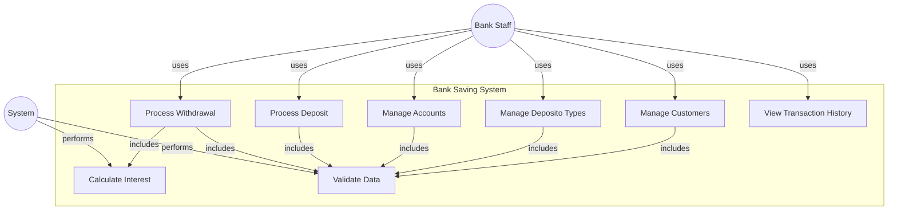

# Use Case Diagram - Bank Saving System

## 🎯 System Overview

Bank Saving System adalah aplikasi untuk mengelola customer, tipe deposito, akun, dan transaksi perbankan dengan perhitungan bunga otomatis.

---

## 👥 Actors

### 1. Bank Staff / User
Pengguna aplikasi mobile yang mengelola data customer dan transaksi perbankan.

### 2. System
Backend API yang memproses business logic, validasi, dan perhitungan bunga.

---

## 📊 Use Case Diagram



---

## 📋 Detailed Use Cases

### UC1: Manage Customers

**Actor:** Bank Staff  
**Description:** Create, view, update, and delete customer records.

**Preconditions:**
- User has access to the application

**Main Flow:**
1. User navigates to Customers screen
2. User can:
   - View list of all customers
   - Search customers by name
   - Create new customer with name
   - View customer details
   - Update customer information
   - Delete customer (if no active accounts)

**Postconditions:**
- Customer data is stored in database
- Changes are reflected in the system

**Includes:** Validate Data (UC8)

---

### UC2: Manage Deposito Types

**Actor:** Bank Staff  
**Description:** Create, view, update, and delete deposito type configurations.

**Preconditions:**
- User has access to the application

**Main Flow:**
1. User navigates to Deposito Types screen
2. User can:
   - View list of all deposito types
   - Create new deposito type (name + yearly return rate)
   - View deposito type details
   - Update deposito type configuration
   - Delete deposito type (if not used by accounts)

**Postconditions:**
- Deposito type configuration is saved
- Interest rates are updated for new accounts

**Includes:** Validate Data (UC8)

---

### UC3: Manage Accounts

**Actor:** Bank Staff  
**Description:** Create, view, and delete customer accounts.

**Preconditions:**
- Customer exists in system
- Deposito type exists in system

**Main Flow:**
1. User navigates to Accounts screen
2. User can:
   - View list of all accounts
   - Filter accounts by customer
   - Create new account (select customer + deposito type + initial balance)
   - View account details with balance
   - Delete account

**Postconditions:**
- Account is created and linked to customer and deposito type
- Initial balance is recorded

**Includes:** Validate Data (UC8)

---

### UC4: Process Deposit

**Actor:** Bank Staff  
**Description:** Add funds to customer account.

**Preconditions:**
- Account exists
- Amount is positive

**Main Flow:**
1. User selects account
2. User enters deposit amount and transaction date
3. System validates amount
4. System updates account balance
5. System records transaction with:
   - Type: deposit
   - Amount
   - Balance before
   - Balance after
   - Transaction date

**Postconditions:**
- Account balance increased
- Transaction recorded in history

**Includes:** Validate Data (UC8)

---

### UC5: Process Withdrawal

**Actor:** Bank Staff  
**Description:** Withdraw funds from account with automatic interest calculation.

**Preconditions:**
- Account exists
- Account has sufficient balance
- Amount is positive

**Main Flow:**
1. User selects account
2. User enters withdrawal amount and transaction date
3. System calculates interest earned:
   - Gets account creation date
   - Calculates months held
   - Applies yearly return rate
   - Formula: `interest = balance × yearly_return × (months_held / 12)`
4. System validates sufficient balance
5. System updates account balance (deduct amount + add interest)
6. System records transaction with:
   - Type: withdrawal
   - Amount
   - Interest earned
   - Months held
   - Balance before
   - Balance after

**Postconditions:**
- Account balance updated with withdrawal and interest
- Transaction recorded with interest details

**Includes:** 
- Calculate Interest (UC7)
- Validate Data (UC8)

---

### UC6: View Transaction History

**Actor:** Bank Staff  
**Description:** View all transactions for an account or system-wide.

**Preconditions:**
- User has access to the application

**Main Flow:**
1. User navigates to Transactions screen
2. User can:
   - View all transactions
   - Filter by account
   - See transaction details (type, amount, date, balance changes)
   - See interest earned (for withdrawals)

**Postconditions:**
- Transaction history is displayed

---

### UC7: Calculate Interest

**Actor:** System  
**Description:** Automatically calculate interest for withdrawal transactions.

**Preconditions:**
- Account has deposito type with yearly return rate
- Account has been active for at least 1 month

**Main Flow:**
1. System retrieves account creation date
2. System calculates duration in months
3. System gets yearly return rate from deposito type
4. System calculates interest:
   ```
   interest = current_balance × yearly_return × (months_held / 12)
   ```
5. System returns calculated interest

**Postconditions:**
- Interest amount calculated
- Interest added to withdrawal transaction

---

### UC8: Validate Data

**Actor:** System  
**Description:** Validate all input data before processing.

**Preconditions:**
- User submits data

**Main Flow:**
1. System validates:
   - Required fields are not empty
   - Data types are correct
   - Numeric values are within valid ranges
   - UUIDs are valid format
   - Dates are valid ISO 8601 format
   - References exist (customer_id, deposito_type_id, account_id)
2. System returns validation result

**Postconditions:**
- Data is validated
- Error messages returned if validation fails

---

## 🔄 Use Case Relationships

### Includes Relationships
- **Manage Customers** includes **Validate Data**
- **Manage Deposito Types** includes **Validate Data**
- **Manage Accounts** includes **Validate Data**
- **Process Deposit** includes **Validate Data**
- **Process Withdrawal** includes **Validate Data** and **Calculate Interest**

### Actor Relationships
- **Bank Staff** interacts with all management and transaction use cases
- **System** performs validation and calculation use cases

---

## 📊 Summary

**Total Use Cases:** 8

**Primary Use Cases (User-Initiated):**
1. Manage Customers
2. Manage Deposito Types
3. Manage Accounts
4. Process Deposit
5. Process Withdrawal
6. View Transaction History

**Supporting Use Cases (System-Performed):**
7. Calculate Interest
8. Validate Data

**Actors:** 2 (Bank Staff, System)

---

## ✅ Coverage

This use case diagram covers all main functionalities:
- ✅ Customer Management (CRUD)
- ✅ Deposito Type Management (CRUD)
- ✅ Account Management (Create, View, Delete)
- ✅ Transaction Processing (Deposit, Withdrawal)
- ✅ Interest Calculation (Automatic)
- ✅ Data Validation (All operations)
- ✅ Transaction History (View)
